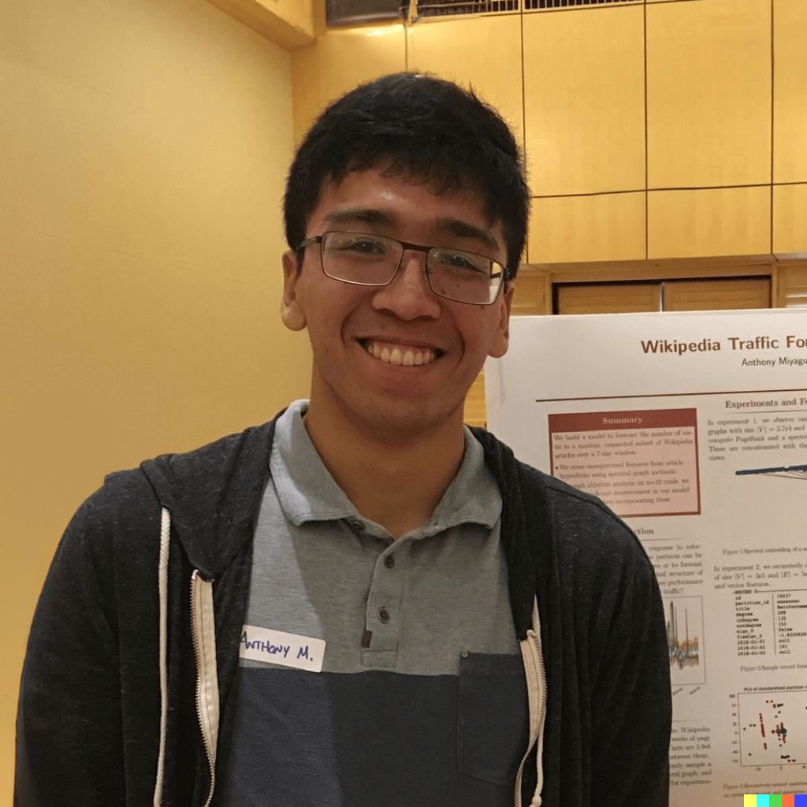
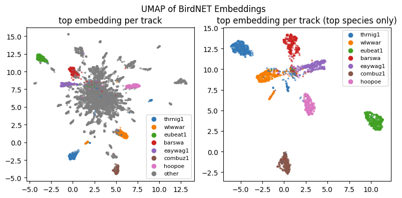
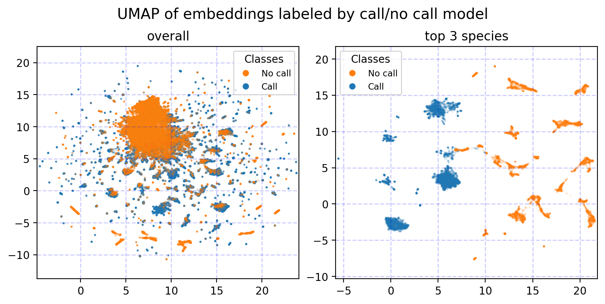

# DS@GT Competition Team

::: columns
:::: {.column width=60%}

## Recruitment

- Built a team of 4 people from DS@GT in Spring 2023
- 3 masters, 1 undergraduate

## Technical Approach

- Use Bird-MixIT to sound separate audio
- Use BirdNET to generate embeddings and labels
- Generate pseudo-labels with heuristics
- Solve supervised classification problem

::::
:::: {.column width=40%}

::::
:::

# Team DS@GT

::: columns
:::: {.column width=50%}

{width=50%}

{width=50%}

::::
:::: {.column width=50%}

{width=50%}

{width=50%}

::::
:::

# Why is audio classification challenging?

{ height=70% }

# Reading the literature

## Domain specific deep learning model - BirdNET

[Kahl, S., Wood, C. M., Eibl, M., & Klinck, H. (2021). BirdNET: A deep learning solution for avian diversity monitoring. Ecological Informatics, 61, 101236.](https://www.sciencedirect.com/science/article/pii/S1574954121000273)

## Sound separation - MixIT

[Denton, T., Wisdom, S., & Hershey, J. R. (2022, May). Improving bird classification with unsupervised sound separation. In ICASSP 2022-2022 IEEE International Conference on Acoustics, Speech and Signal Processing (ICASSP) (pp. 636-640). IEEE.](https://arxiv.org/abs/2110.03209)

---

# Approach

## Outline

- Use Bird-MixIT to sound separate audio
- Use BirdNET to generate embeddings and labels
- Generate pseudo-labels with heuristics
- Solve supervised classification problem

# Sound Separation with MixIT

{ height=70% }

# BirdNET embeddings

{ height=70% }

# BirdNET soft-labels as pseudo-labels

{ height=70% }

# Supervised learning: classification

{ height=70% }

# Engineering challenges

## Outline

- Pre-processing audio data
- Time-resolution mismatches
- Classification implementations and performance

# Preprocessing audio data: Luigi pipelines

{ height=70% }

# Time-resolution mismatches

{ height=70% }

# Classification implementations and performance

<!-- prettier-ignore -->
\begin{table}[h]
\caption{
A comparison between fit and predict the time for various models fit on a GCP n1-standard-4 compute instance with a Telsa T4 GPU. 
We fit the post-v7 dataset, which has 255,372 rows.
}
\begin{tabular}{|l|l|l|l|}
\hline
Model                                                 & GPU & Fit time    & Predict time \\ \hline
Logistic Regression                                   & No  & 59 min 17 s & 1.5 s          \\ \hline
SVC                                                   & No  & 90 min +    & -              \\ \hline
MLP                                                   & No  & 4 min 14 s  & 3.5 s          \\ \hline
XGBoost (hist)                                        & No  & 48 min 20 s & 14.4 s         \\ \hline
XGBoost (gpu\_hist)                                   & Yes & 5 min       & 15.3 s         \\ \hline
ComplementNB                                          & No  & 4.2 s       & 1.5 s          \\ \hline
\end{tabular}
\label{tab:model-fit-time}
\end{table}

---

# Results

## Outline

- Overall performance
- Experiments with psuedo-labeling and augmentation

# Overall performance

<!-- prettier-ignore -->
\begin{table}[h!]
\caption{
  A summary of few models.
  Logistic regression is our simplest model.
  XGBoost is trained on a multi-label dataset.
}
\begin{tabular}{|l|l|l|}
\hline
\textbf{Model} & \textbf{Public Score} & \textbf{Private Score} \\ \hline
Logistic Regression & 0.78541 & 0.68369 \\ \hline
MLP & 0.74014 & 0.62283 \\ \hline
XGBoost & 0.79068 & 0.68181 \\ \hline
\end{tabular}
\label{tab:model-summary}
\end{table}

# Experiments

## Psuedo-labeling

- Use the primary class of the track as the label, when the confidence is above a threshold
- Multi-label classification

## Data Augmentation

Embedding augmentation via concatenation and averaging.

<!-- prettier-ignore -->
\begin{align}
    \hat{y} &\sim M_1(v_t) \\
    \hat{y} &\sim M_2(v_t \oplus v_{t+1}) \\
    \hat{y} &\sim M_3(v_t \oplus \sum_{i=0}^{n} v_i) \\
    \hat{y} &\sim M_4(v_t \oplus v_{t+1} \oplus \sum_{i=0}^{n} v_i)
\end{align}

---

# Next time

- More variations of semi-supervision
  - A more rigorous approach to evaluation
- Comparisons of embedding models
  - Meta AudioGen, OpenAI Whisper, Mozilla DeepSpeech
- Embedding dynamics
  - Linear dynamics with forcing function, found via SVD?
  - Motif mining of the forcing function
  - Scale of the problem is best solved by Spark
- Sequence models
  - Learn a sequence model that best predicts the optimal set of classes
  - All data can be fed in one model start to end
    - Would rather this be in Torch, rather than Tensorflow, which leans toward the direction of AudioGen

---

# And for the DS@GT Folks...

{ height=50% }

# Advice for myself two years ago

## Building a team is worthwhile

- A strong team can help you achieve more than you could on your own.
  It's also an opportunity to connect with other students.

## Be prepared to learn how to lead a team

- Effective communication and clear timelines are key to keeping the team on track
- Remember that everyone on the team is capable and valuable, and make an effort to recognize and appreciate their contributions

## Reach out to OMSCS and OMSA early

- Working professionals have _a lot_ to bring to the table.

# Recruitment: Outreach

{ height=70% }

# Be on the lookout for opportunities

{ height=50%}

<!-- https://pixnio.com/people/children-kids/a-close-shot-of-children-birdwatching# -->

There's an abundance of opportunities for OMSCS students to collaborate with other students.

# Thank you to everyone involved

::: columns
:::: column

## DS@GT Leadership

- Pulak Agarwal
- Krishi Manek

## BirdCLEF 2022

- Jiangyue Yu
- Bryan Cheungvivatpant
- Dakota Dudley
- Aniketh Swain

::::
:::: column

## BirdCLEF F22 EDA

- Jinsong Zhen
- Kien Tran
- Siying Liu
- Muskaan Gupta
- Xinjin Li

## BirdCLEF 2023

- Chris Hayduk
- Erin Middlemas
- Grant Williams
- Nathan Zhong
- Murilo Gustineli

::::
:::

# Links and Resources

- [Working Notes, "Motif Mining and Unsupervised Representation Learning for BirdCLEF 2022"](https://short.acmiyaguchi.me/birdclef-2022-working-notes)
- [DS@GT, Kaggle Competition Team Proposal, BirdCLEF 2022](https://short.acmiyaguchi.me/dsgt-birdclef-2022-proposal)
- [DS@GT, Project Group Proposal, BirdCLEF EDA Fall 2022](https://short.acmiyaguchi.me/dsgt-birdclef-eda-f22-proposal)
- [DS@GT, Kaggle Competition Team Proposal, BirdCLEF 2023](https://short.acmiyaguchi.me/dsgt-birdclef-2023-proposal)
- [DS@GT, Assessment, BirdCLEF EDA Fall 2022](https://short.acmiyaguchi.me/dsgt-birdclef-eda-f22-assessment)
- [DS@GT, Assessment, BirdCLEF 2023](https://short.acmiyaguchi.me/dsgt-birdclef-2023-assessment)
- [BirdCLEF Motif Viewer, Barn Owl, XC138041](https://short.acmiyaguchi.me/birdclef-brnowl-motif)
- [BirdCLEF 2023 MixIT Exploration, Red-chested Cuckoo, 2FXC207767](https://birdclef-2023.dsgt-kaggle.org/mixit-exploration?detailed=false&track=reccuc1%2FXC207767.ogg)

# Thank you!

## Time for Questions and Answers

{ height=70% }

<!-- https://commons.wikimedia.org/wiki/File:Flock_of_Birds_%287175071318%29.jpg -->
