# Who am I?

::: columns
:::: {.column width=40%}

::::
:::: {.column width=60%}

- A Software Engineer
  - 5 years as a Data Engineer at Mozilla
  - 1.5 years as a Software Engineer at Planet Labs
- OMSCS, matriculated Spring 2022
  - B.S. Computer Science and Engineering from UCLA 2016
  - Graduate Certificate from Stanford Center for Professional Development (SCPD) 2018
- Career focus on scalable data systems and machine learning

::::
:::

# Overview

- What is Kaggle?
- Why Kaggle?
- BirdCLEF 2022
  - Recruitment and Technical Approach
- BirdCLEF 2023
  - Updated Recruitment and Technical Approach
- Thoughts and Advice
- Q&A

# What is Kaggle?

{ height=80% }

# Kaggle is what got me into Graduate School

{ height=60% }

# Reading and Implementing Research Papers

{ height=70% }

# Stanford CS229 Machine Learning Project

{ height=70% }

---

# Why Kaggle?

::: columns
:::: {.column width=40%}

::::
:::: {.column width=60%}

## Reasons to consider Kaggle

- Good start to a **research project**
  - Access to impactful real-world problems
    - bird conservation, cancer detection, etc.
- **Structure and deadlines** to stay on track
- Anyone can participate, with a focus on **practical applications and the potential to win cash prizes**

::::
:::

# BirdCLEF

{ height=70% }

# DS@GT Competition Team

::: columns
:::: {.column width=60%}

## Recruitment

- Built a team of 5 people from DS@GT in Spring 2022
- 3 masters students and 2 undergraduates

## Technical Approach

- **Motif Mining** with SiMPLe-Fast
  - Find salient sections of audio for classification
- **Unsupervised Representation Learning** via Triplet Loss
  - Train an embedding for downstream tasks

::::
:::: {.column width=40%}

::::
:::

# Why is audio classification challenging?

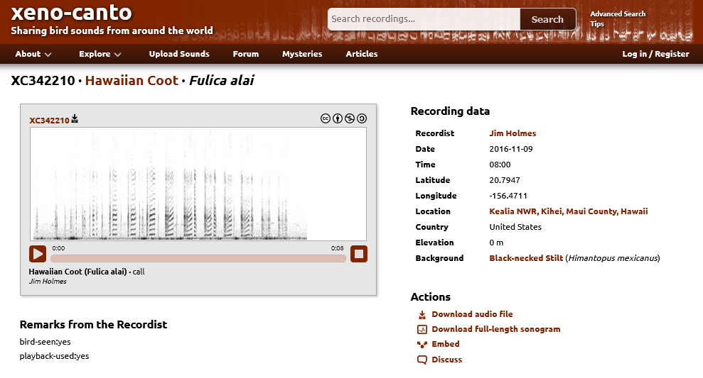{ height=70% }

# Reading the literature

## Motif Mining - SiMPLe-Fast

[Silva, D. F., Yeh, C. C. M., Zhu, Y., Batista, G. E., & Keogh, E. (2018). Fast similarity matrix profile for music analysis and exploration. IEEE Transactions on Multimedia, 21(1), 29-38.](https://www.cs.ucr.edu/~eamonn/final-fast-similarity-3.pdf)

## Spatial Embeddings - Tile2Vec

[Jean, N., Wang, S., Samar, A., Azzari, G., Lobell, D., & Ermon, S. (2018). Tile2Vec: unsupervised representation learning for spatially distributed data. arXiv.](https://arxiv.org/abs/1805.02855)

# Motif Mining with SiMPLe-Fast

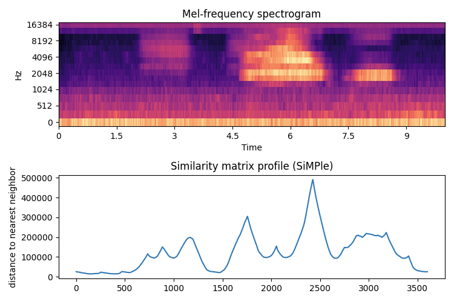{ height=70% }

# Representation Learning via Triplet Loss

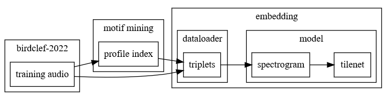{ height=70% }

# Working Notes

{ height=70% }

# Results of BirdCLEF 2022

## Best Working Notes Award

We performed poorly, but we kept good notes and had a unique approach.
We won $2,500 in Google Cloud Platform credits.

## Personal Takeaways

- Building a team is worthwhile and a forcing function for progress
- Managing a team of 5 people is challenging
- 6 weeks is not enough time for meaningful contributions to a large codebase

---

# Approaching BirdCLEF 2023

## New year, new team

- Building the team from the get-go
- Proposals, assessments, and interviews
- Reaching out to Slack, EdStem, and DS@GT

## New technical approach

- Retrain using embeddings from older models
- Build a process for machine-assisted dataset annotation
- Toy with sequence models (RNNs, Transformers, etc.)

# Recruitment: Proposal

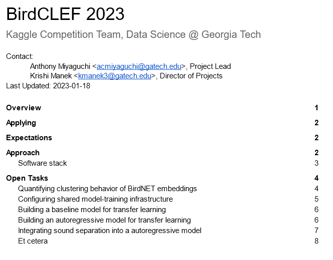{ height=70% }

# Recruitment: Assessment

::: columns
:::: {.column width=50%}

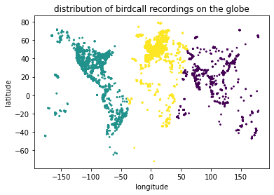{ height=70% }

::::
:::: {.column width=50%}

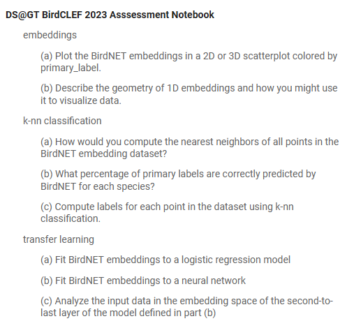{ height=70% }

::::
:::

# Recruitment: Outreach

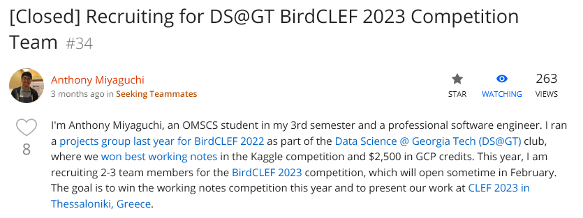{ height=70% }

## Reach out to other students!

- Slack: OMSCS Study Group and OMSA Study Group
- EdStem: OMSCS Research
- Clubs: Data Science @ Georgia Tech

# Organization

## Team Structure

- Weekly meetings over Zoom once a week for 45 minutes
- Slack channel for communication
- Shared GitHub and Google Cloud Project

## Being a Project Lead

Leading a team is challenging.
Every team is different, and every leader has their own style.

# Technical approach

## Outline

- Building data pipelines with Luigi
- BirdNET embeddings
- Sound Separation with MixIT
- Automated dataset annotation
- Sequence models with embeddings

# Reading the literature, yet again

## Domain specific deep learning model - BirdNET

[Kahl, S., Wood, C. M., Eibl, M., & Klinck, H. (2021). BirdNET: A deep learning solution for avian diversity monitoring. Ecological Informatics, 61, 101236.](https://www.sciencedirect.com/science/article/pii/S1574954121000273)

## Sound separation - MixIT

[Denton, T., Wisdom, S., & Hershey, J. R. (2022, May). Improving bird classification with unsupervised sound separation. In ICASSP 2022-2022 IEEE International Conference on Acoustics, Speech and Signal Processing (ICASSP) (pp. 636-640). IEEE.](https://arxiv.org/abs/2110.03209)

# Building data pipelines with Luigi

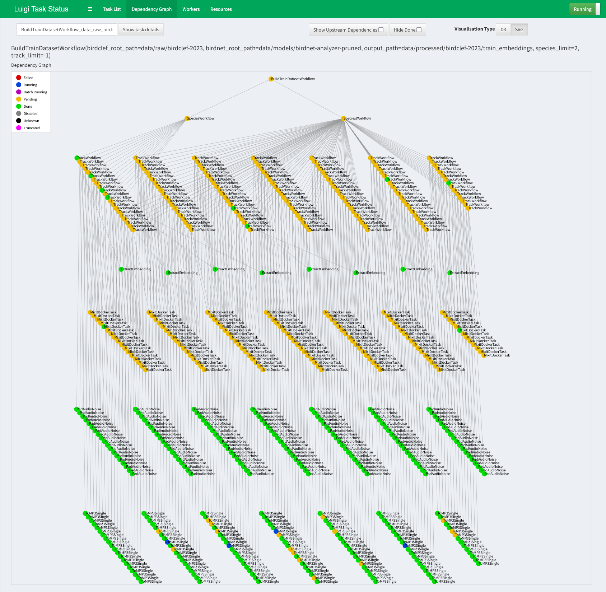{ height=70% }

# BirdNET embeddings

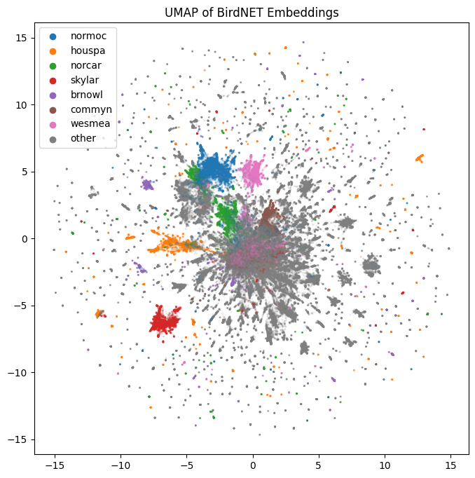{ height=70% }

# BirdNET predictions for annotation

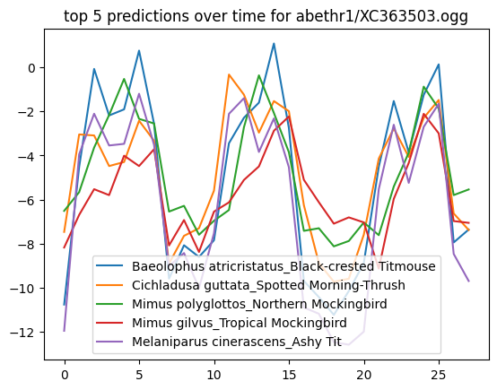{ height=70% }

# Sound Separation with MixIT

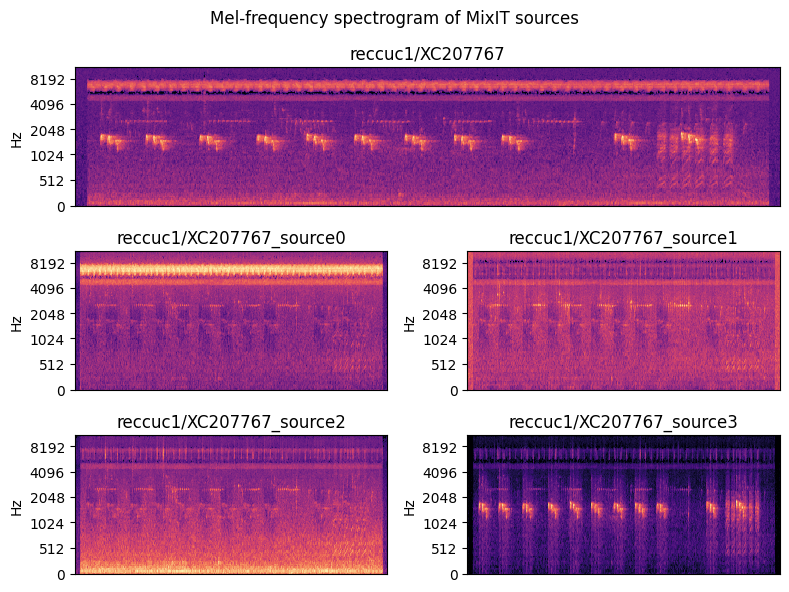{ height=70% }

# Automated dataset annotation

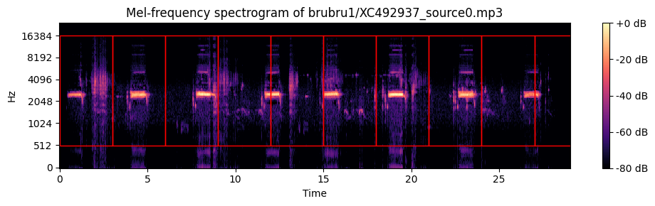{ height=70% }

# Sequence models with embeddings

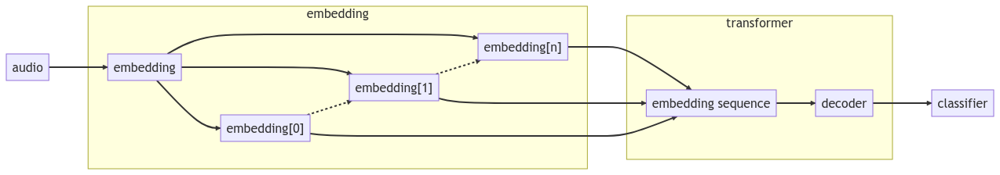{ height=70% }

# BirdCLEF 2023 is ongoing!

{ height=50% }

## Interested in joining?

Talk to me if you're interesting in jumping in last minute.

---

# Advice for myself one year ago

## Building a team is worthwhile

- A strong team can help you achieve more than you could on your own.
  It's also an opportunity to connect with other students.

## Be prepared to learn how to lead a team

- Effective communication and clear timelines are key to keeping the team on track
- Remember that everyone on the team is capable and valuable, and make an effort to recognize and appreciate their contributions

## Reach out to OMSCS and OMSA early

- Working professionals have _a lot_ to bring to the table.

# Be on the lookout for opportunities

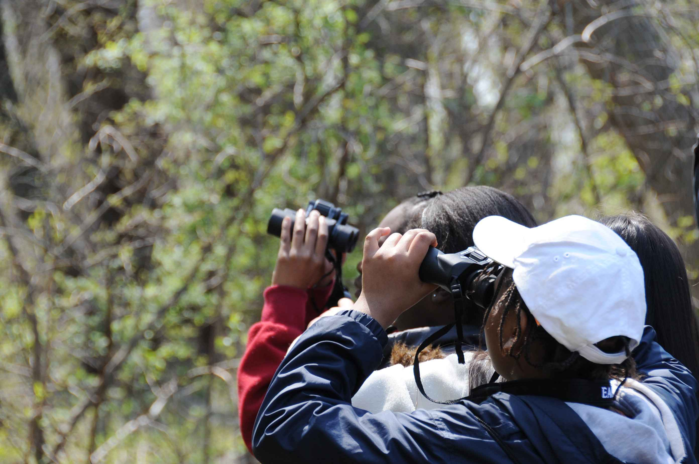{ height=50%}

<!-- https://pixnio.com/people/children-kids/a-close-shot-of-children-birdwatching# -->

There's an abundance of opportunities for OMSCS students to collaborate with other students.

# Thank you to everyone involved

::: columns
:::: column

## DS@GT Leadership

- Pulak Agarwal
- Krishi Manek

## BirdCLEF 2022

- Jiangyue Yu
- Bryan Cheungvivatpant
- Dakota Dudley
- Aniketh Swain

::::
:::: column

## BirdCLEF F22 EDA

- Jinsong Zhen
- Kien Tran
- Siying Liu
- Muskaan Gupta
- Xinjin Li

## BirdCLEF 2023

- Chris Hayduk
- Erin Middlemas
- Grant Williams
- Nathan Zhong

::::
:::

# Links and Resources

- [Working Notes, "Motif Mining and Unsupervised Representation Learning for BirdCLEF 2022"](https://short.acmiyaguchi.me/birdclef-2022-working-notes)
- [DS@GT, Kaggle Competition Team Proposal, BirdCLEF 2022](https://short.acmiyaguchi.me/dsgt-birdclef-2022-proposal)
- [DS@GT, Project Group Proposal, BirdCLEF EDA Fall 2022](https://short.acmiyaguchi.me/dsgt-birdclef-eda-f22-proposal)
- [DS@GT, Kaggle Competition Team Proposal, BirdCLEF 2023](https://short.acmiyaguchi.me/dsgt-birdclef-2023-proposal)
- [DS@GT, Assessment, BirdCLEF EDA Fall 2022](https://short.acmiyaguchi.me/dsgt-birdclef-eda-f22-assessment)
- [DS@GT, Assessment, BirdCLEF 2023](https://short.acmiyaguchi.me/dsgt-birdclef-2023-assessment)
- [BirdCLEF Motif Viewer, Barn Owl, XC138041](https://short.acmiyaguchi.me/birdclef-brnowl-motif)
- [BirdCLEF 2023 MixIT Exploration, Red-chested Cuckoo, 2FXC207767](https://birdclef-2023.dsgt-kaggle.org/mixit-exploration?detailed=false&track=reccuc1%2FXC207767.ogg)

# Thank you!

## Time for Questions and Answers

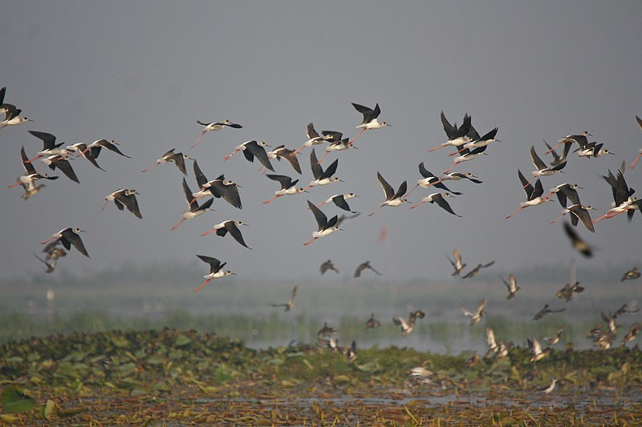{ height=70% }

<!-- https://commons.wikimedia.org/wiki/File:Flock_of_Birds_%287175071318%29.jpg -->
