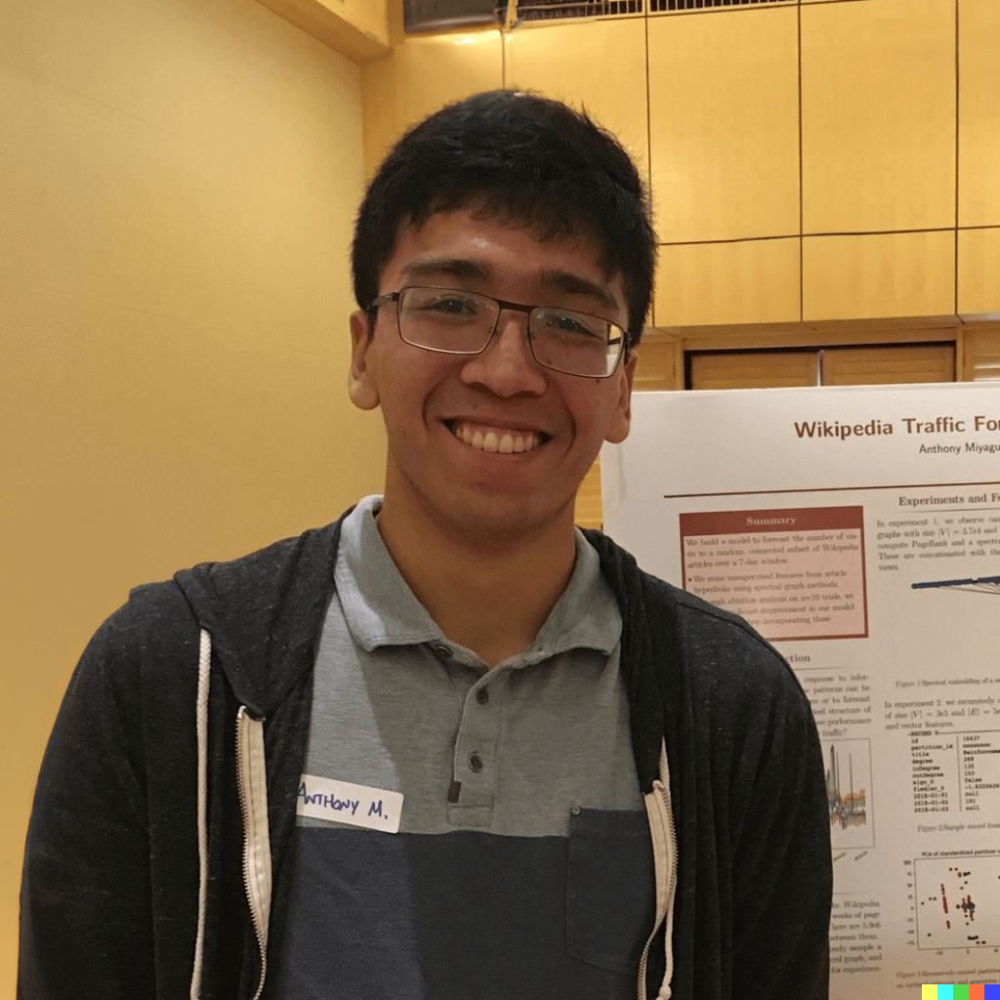
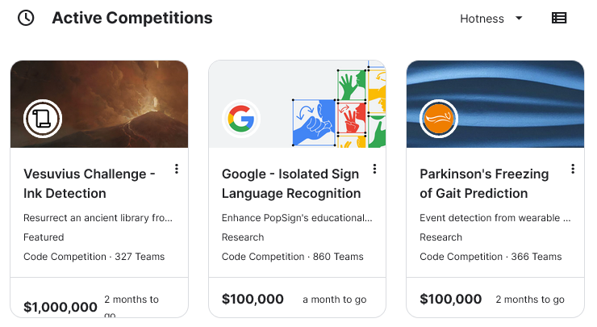
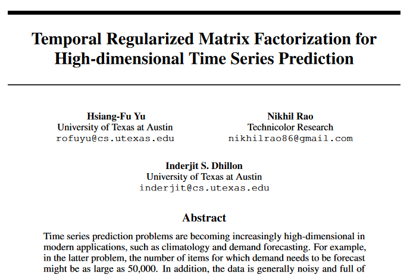
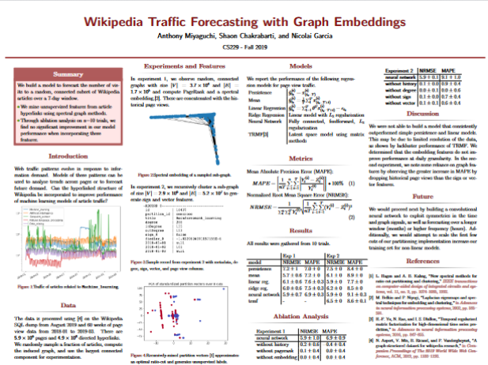
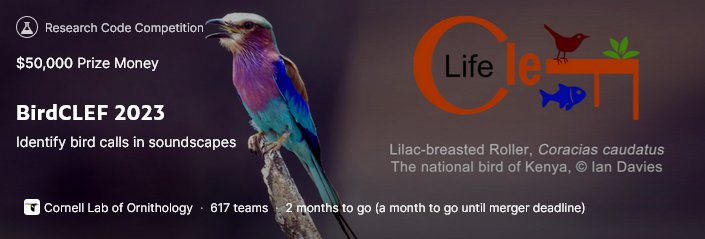

# Who am I?

::: columns
:::: {.column width=40%}

::::
:::: {.column width=60%}

- A Software Engineer
  - 5 years as a Data Engineer at Mozilla
  - 1.5 years as a Software Engineer at Planet Labs
- OMSCS, matriculated Spring 2022
  - B.S. Computer Science and Engineering from UCLA 2016
  - Graduate Certificate from Stanford Center for Professional Development (SCPD) 2018
- Career focus on scalable data systems and machine learning

::::
:::

# What is Kaggle?

{ height=80% }

# Kaggle is what got me into Graduate School

{ height=60% }

# Reading and Implementing Research Papers

{ height=70% }

# Stanford CS229 Machine Learning Project

{ height=70% }

# Why Kaggle?

- Can be a good start to a research project
- Structure and deadlines can help you stay on track
- Anyone can participate; application-heavy focus and cash prizes

# BirdCLEF

{ height=70% }

# DS@GT Competition Team

# Advice for myself one year ago

# Thank you!

---

# Appendix

Not entirely sure what I want to keep in the slides, so here's a bunch of potential slides.

# OMSCS is what you make of it!

- Try your hand at research
- For many of us, this may be our last encounter with academia

# You have valuable skills!

- You have a unique perspective
- You have a unique skillset
- You have a unique background

# So how do you start?

- Find a problem that you care about
- Find a problem that you can solve
- My recommendation: look at academic competitions

# Organization

- Leverage your professional skills!
- Write proposals
- Create a GitHub repository
- Run weekly meetings and keep note documents

1:1 meetings can be useful.

# Recruitment

- EdStem
- On-campus clubs -> Data Science @ Georgia Tech
- Slack: OMSCS and OMSA

# Accept that people have different priorities

People will drop, and that's okay.

# Heads down, work hard, and get over the finish line

You're competing to win against other teams.
Put in the work.

# Publish something!

A paper?
A blog post?
A video?
